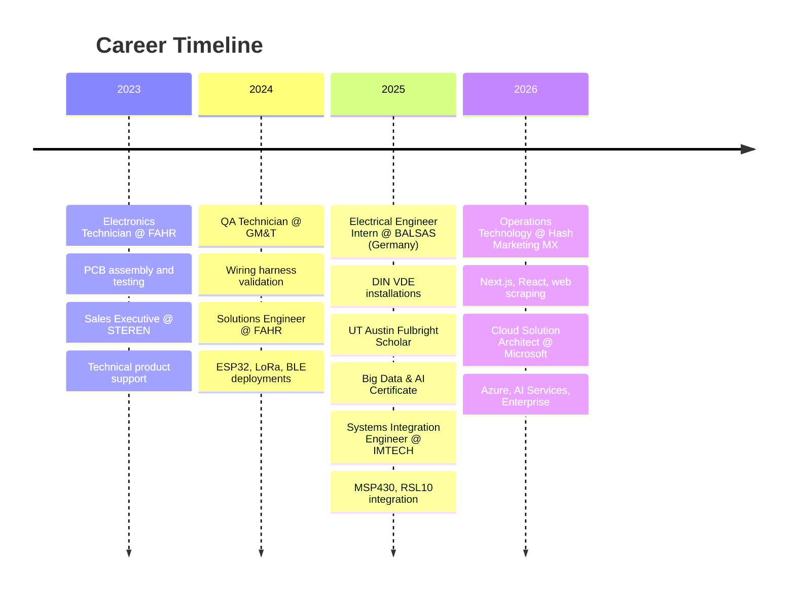
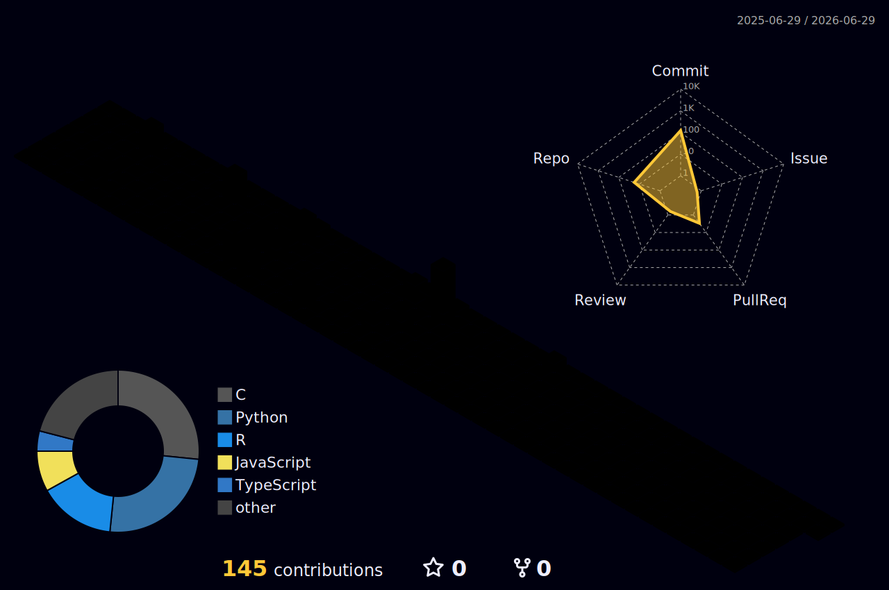

<div align="center">

<!-- Animated Header -->


<!-- Typing Animation -->
<a href="https://git.io/typing-svg"></a>

<!-- Random Dev Quote -->


<!-- Social Badges -->
<p>
<a href="https://www.linkedin.com/in/rafael-glez-chong/"></a>
<a href="mailto:rafael.glez.chong@gmail.com"></a>
<a href="https://github.com/surbalo1"></a>
<a href="https://rafael-gonzalez.vercel.app/"></a>

</p>

</div>

---

## 🧑‍💻 About Me

```yaml
name: Rafael Ignacio González Chong
location: Mexico City, Mexico
phone: "+52 614 162 5912"
role: Cloud Solution Architect @ Microsoft

background: |
  Cloud Solution Architect at Microsoft with a foundation in electronics 
  engineering, embedded systems, and IoT. Experienced in translating complex 
  technical requirements into practical solutions across hardware and software 
  domains. Currently building expertise in Azure cloud architecture, AI services, 
  and enterprise customer engagement. Combines hands-on engineering background 
  with cross-functional coordination skills to bridge the gap between business 
  needs and cloud-native solutions.

work:
  - Azure cloud architecture & solution design
  - Enterprise customer engagement (CSAM, ATS, AE)
  - AI services & cloud-native solutions
  - Systems integration and field deployment
  - Embedded firmware (MSP430, RSL10, ESP32, PIC)
  - IoT connectivity (BLE, LoRa, MQTT)
  - Full-stack web development (Next.js, React, TypeScript)
  - Technical support and customer-facing solutions
  - Documentation and project coordination

languages:
  - Spanish (Native)
  - English (C1)
  - German (A2)
```

---

## ⚡ Currently

<div align="center">

| Working On | Learning | Ask Me About |
|:----------:|:--------:|:------------:|
| Cloud Solution Architecture @ Microsoft | Azure IaaS, PaaS & AI Services | Azure, Cloud Architecture |
| CSA Accelerate Onboarding Program | Cloud-edge patterns | ESP32, MSP430, RSL10 |
| Enterprise customer engagement | Security & AI certifications | IoT field integration |
| Internal enablement & labs | Rust for embedded | I2C, SPI, UART, MQTT |

</div>

---

## 🛠️ Tech Stack

<div align="center">

<!-- Skill Icons (Modern Display) -->
<a href="https://skillicons.dev">
  
</a>

</div>

<div align="center">

### 💻 Programming


### ☁️ Cloud & Enterprise


### 🌐 Web & Frontend


### 🔧 Microcontrollers & Hardware


### 📡 Protocols & Connectivity


### 🤖 Data & ML


### 🛠️ Tools & Platforms


</div>

---

## 📊 GitHub Analytics

<div align="center">


</div>

<div align="center">

</div>

<div align="center">

</div>

<!-- GitHub Trophies -->
<div align="center">

### 🏆 GitHub Trophies


</div>

<!-- Profile Summary Cards -->
<div align="center">

### 📈 Profile Summary


</div>

---

## 🚀 Projects

<div align="center">

| Project | What It Does | Stack |
|:--------|:-------------|:------|
| ⚡ [**ESP32 AC Motor Controller**](https://github.com/surbalo1/esp32-ac-motor-controller) | PID speed control for AC motor using TRIAC phase-angle modulation with encoder feedback | `C++` `ESP32` `PID` |
| 🌡️ [**IoT Sensor Pipeline**](https://github.com/surbalo1/iot-sensor-pipeline) | Data ingestion from sensors → MQTT → Node.js backend → PostgreSQL → dashboard | `JavaScript` `PostgreSQL` `Docker` |
| 😊 [**Emotion Recognition**](https://github.com/surbalo1/real-time-emotion-recognition) | Webcam-based facial emotion detection using OpenCV and FER model | `Python` `OpenCV` `Streamlit` |
| 🔌 [**RSL10 I2C Communication**](https://github.com/surbalo1/RSL10-Arduino-I2C-Communication) | Software I2C bit-bang between RSL10 (master) and Arduino (slave) | `C` `I2C` `Embedded` |
| 🤖 [**AI Chatbot**](https://github.com/surbalo1/multi-personality-chatbot) | Python NLP assistant with contextual memory | `Python` `Streamlit` `LLM` |
| 📊 [**UT Austin Big Data**](https://github.com/surbalo1/ut-austin-big-data-analysis) | Predictive models from Fulbright program (80% accuracy) | `R` `Python` `TensorFlow` |
| 🔋 [**RSL10 ADC Monitor**](https://github.com/surbalo1/rsl10-adc-vddc-monitor) | 14-bit ADC voltage monitoring with UART output | `C` `ADC` `Low-Power` |
| 🔧 [**BSP for ESP32 & PIC18F**](https://github.com/surbalo1/embedded-bsp-esp32-pic18f) | Board support package with HAL for GPIO, UART, ADC | `C` `ESP32` `PIC` |
| 💊 [**Pharmacy AI Automation**](https://github.com/surbalo1/Pharmacy-AI-automation-system) | AI assistant for pharmacy operations and automation | `Python` `AI` `Automation` |
| 🎯 [**AI Coaching System**](https://github.com/surbalo1/ai-coaching-system) | FastAPI + React coaching platform with AI-powered insights | `FastAPI` `React` `LLM` |

</div>

<details>
<summary>📂 <b>All Projects by Category</b></summary>

### 🔌 Embedded Systems & Firmware
- [`esp32-ac-motor-controller`](https://github.com/surbalo1/esp32-ac-motor-controller) - PID-based AC motor control with phase-angle modulation
- [`embedded-bsp-esp32-pic18f`](https://github.com/surbalo1/embedded-bsp-esp32-pic18f) - Hardware abstraction layer for ESP32 and PIC18F
- [`rsl10-blinky-rtt-debug`](https://github.com/surbalo1/rsl10-blinky-rtt-debug) - ARM Cortex-M3 LED control with SEGGER RTT debugging
- [`RSL10-UART-LED-Control`](https://github.com/surbalo1/RSL10-UART-LED-Control) - Bidirectional UART with command confirmation
- [`RSL10-SysTick-Timestamp`](https://github.com/surbalo1/RSL10-SysTick-Timestamp) - SysTick timestamp system with low-power sleep
- [`rsl10-adc-vddc-monitor`](https://github.com/surbalo1/rsl10-adc-vddc-monitor) - 14-bit ADC voltage monitoring
- [`msp430-arduino-uart-bridge`](https://github.com/surbalo1/msp430-arduino-uart-bridge) - Serial bridge with state machine

### 🌐 IoT & Connectivity
- [`iot-sensor-pipeline`](https://github.com/surbalo1/iot-sensor-pipeline) - MQTT → Node.js → PostgreSQL → Dashboard
- [`sensor-dashboard`](https://github.com/surbalo1/sensor-dashboard) - Real-time visualization with Socket.io and Chart.js
- [`esp32-weather-client`](https://github.com/surbalo1/esp32-weather-client) - Weather dashboard with MQTT
- [`RSL10-Arduino-I2C-Communication`](https://github.com/surbalo1/RSL10-Arduino-I2C-Communication) - Software I2C implementation

### 🤖 AI & Data
- [`Pharmacy-AI-automation-system`](https://github.com/surbalo1/Pharmacy-AI-automation-system) - AI assistant for pharmacy operations
- [`ai-coaching-system`](https://github.com/surbalo1/ai-coaching-system) - FastAPI + React coaching platform
- [`multi-personality-chatbot`](https://github.com/surbalo1/multi-personality-chatbot) - LLM chatbot with memory
- [`real-time-emotion-recognition`](https://github.com/surbalo1/real-time-emotion-recognition) - Facial emotion detection
- [`ut-austin-big-data-analysis`](https://github.com/surbalo1/ut-austin-big-data-analysis) - Predictive analytics projects

</details>

---

## 💼 Experience

<div align="center">


```mermaid
timeline
    title Career Timeline
    2023 : Electronics Technician @ FAHR
         : PCB assembly and testing
         : Sales Executive @ STEREN
         : Technical product support
    2024 : QA Technician @ GM&T
         : Wiring harness validation
         : Solutions Engineer @ FAHR
         : ESP32, LoRa, BLE deployments
    2025 : Electrical Engineer Intern @ BALSAS (Germany)
         : DIN VDE installations
         : UT Austin Fulbright Scholar
         : Big Data & AI Certificate
         : Systems Integration Engineer @ IMTECH
         : MSP430, RSL10 integration
    2026 : Operations Technology @ Hash Marketing MX
         : Next.js, React, web scraping
         : Cloud Solution Architect @ Microsoft
         : Azure, AI Services, Enterprise
```

</div>

### ☁️ Current Role
**Cloud Solution Architect** @ Microsoft *(Apr 2026 – Present)*
- Completing Microsoft's CSA Accelerate onboarding program, developing technical depth in Azure cloud architecture
- Engaging with cross-functional account teams (CSAM, ATS, AE) to build foundational knowledge of enterprise customer engagement
- Building hands-on proficiency across Azure infrastructure, security, and AI through internal enablement programs, labs, and certification preparation
- Tools: Azure (IaaS, PaaS, AI Services), Microsoft 365, Cloud Architecture, Solution Design

### 💻 Previous Role — Operations Technology
**Operations Technology** @ Hash Marketing MX *(Mar 2026 – Apr 2026)*
- Built a Next.js frontend including a contract wizard and admin dashboard with role-based access
- Integrated frontend with backend APIs to support contract workflows and debugged API issues during development
- Implemented an admin override flow to maintain operational continuity when validation systems failed
- Developed web scraping scripts and automation tools to extract and organize data for internal workflows
- Tools: Next.js, React, TypeScript, Firebase, REST APIs, JavaScript, Puppeteer, Git, GitHub

### 🔧 Previous Role — Systems Integration
**Systems Integration Engineer** @ IMTECH Desarrollos *(Sep 2025 – Dec 2025)*
- Supported system-level validation of embedded platforms (MSP430, RSL10) using PLC test benches and hardware setups
- Supported delivery execution and onboarding of junior engineers
- Tools: Excel, UART, SPI, I2C, PLC test benches, PCBs, schematics, Git

### 🌍 International Experience
**Electrical Engineer Intern** @ BALSAS GmbH, Germany *(Jan 2025 – Jul 2025)*
- Supported residential electrical renovation projects under DIN VDE standards
- Coordinated on-site activities with customers, inspectors, and contractors, ensuring compliance and schedule adherence
- Assisted in resolving installation issues, reducing rework and inspection delays
- Tools: Electrical tools, DIN VDE 0100, DIN VDE 0105

### 💡 Previous Roles

<details>
<summary><b>Solutions Engineer @ FAHR Electronic Systems</b> (May 2024 – Jan 2025)</summary>

- Implemented ESP32-based solutions supporting prototype validation and client-facing demonstrations
- Delivered technical demos and validated prototypes for client acceptance
- Produced deployment and maintenance documentation
- Tools: ESP32, MicroPython, LoRa, BLE, OTA, UART, SPI, I2C, Git, PCBs, schematics
</details>

<details>
<summary><b>QA Technician @ GM&T Engineering, Inc.</b> (Nov 2023 – May 2024)</summary>

- Executed wiring harness validation per OEM and ISO TS 16949, achieving 98% first-pass yield
- Supported root cause analysis and continuous improvement initiatives
- Tools: Wiring harness testers, multimeter, ISO TS 16949
</details>

<details>
<summary><b>Sales Executive @ STEREN Mexico</b> (Jun 2023 – Nov 2023)</summary>

- Advised customers on electronic products, increasing repeat purchases by 10%
- Supported pre-sales product selection and basic troubleshooting
- Tools: POS systems, product catalogs, technical datasheets
</details>

<details>
<summary><b>Electronics Technician @ FAHR Electronic Systems</b> (Jan 2023 – Jun 2023)</summary>

- Assembled and tested IoT PCB prototypes
- Supported installation troubleshooting, reducing debugging time by 25%
- Assisted with prototype validation for customer acceptance
- Tools: Oscilloscope, soldering tools, IoT sensors
</details>

---

## 🎓 Education

<div align="center">

| Institution | Degree | Period | Notes |
|:------------|:-------|:-------|:------|
| 🏛️ **University of Texas at Austin** | Global Summer Institute (Big Data & AI) | Jul–Aug 2025 | Fulbright-COMEXUS Scholar • 120hr program • Built predictive models (80% accuracy) with Python, TensorFlow, PyTorch |
| 🎓 **Chihuahua Institute of Technology** | B.Sc. Electronic Engineering | Aug 2020 – Dec 2024 | GPA: 90.83/100 • Minor: Intelligent Embedded Systems • Courses: RTOS, FPGA, DSP, Microcontrollers, PLC, Power Electronics • IEEE Student Branch • Coordinated Top Business Leader Diploma (50+ students) |

</div>

---

## 🏆 Certifications

<div align="center">

### 🔐 Cybersecurity
-FF0000?style=flat-square&logo=comptia&logoColor=white)

### ☁️ Cloud & AI
-0078D4?style=flat-square&logo=microsoftazure&logoColor=white)


### 📊 Data & Analytics


### 📋 Project Management


### 💻 Development


### 🌐 Languages
-58CC02?style=flat-square&logo=duolingo&logoColor=white)

</div>

---

## 🧰 Skills Summary

<div align="center">

| Category | Details |
|:---------|:--------|
| **Programming & Web** | Python, JavaScript, TypeScript, React, Next.js, REST APIs, Firebase, C, MicroPython, MATLAB, R |
| **Cloud & Enterprise** | Azure (IaaS, PaaS, AI Services), Microsoft 365, Cloud Architecture, Solution Design |
| **Embedded, IoT & Hardware** | ESP32, FreeRTOS, UART, SPI, I2C, MQTT, OTA, PCB design, schematics, oscilloscope, multimeter, PLC test benches |
| **Tools & DevOps** | Git, Docker, Linux, VS Code, Excel, pandas, NumPy, Puppeteer |
| **Soft Skills** | Problem-solving, stakeholder communication, cross-functional coordination, documentation, adaptability |

</div>

---

## 📫 Contact

<div align="center">

Open to discussing cloud architecture, Azure solutions, embedded systems, IoT, or collaboration opportunities.

[](https://www.linkedin.com/in/rafael-glez-chong/)
[](mailto:rafael.glez.chong@gmail.com)
[](https://rafael-gonzalez.vercel.app/)

</div>

---

<div align="center">

<!-- Snake Animation (Generated from my contributions) -->
<picture>
  <source media="(prefers-color-scheme: dark)" srcset="https://raw.githubusercontent.com/surbalo1/surbalo1/output/github-snake-dark.svg">
  <source media="(prefers-color-scheme: light)" srcset="https://raw.githubusercontent.com/surbalo1/surbalo1/output/github-snake.svg">
  
</picture>


<!-- 3D Contribution Calendar (Generated by GitHub Action) -->


</div>

---

<div align="center">

<!-- Random Joke -->


</div>

---

<div align="center">

### *Cloud Solution Architect @ Microsoft — Azure, Embedded Systems, IoT, Field Implementation*


</div>
