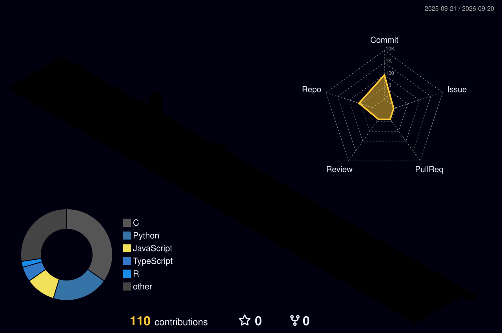

<div align="center">


### I connect cloud architecture, AI, software, and embedded systems.

[](https://www.linkedin.com/in/rafael-glez-chong/)
[](https://rafael-gonzalez.vercel.app/)
[](mailto:rafael.glez.chong@gmail.com)

</div>

## About me

I am a Cloud Solution Architect at Microsoft with a background in electronics engineering, embedded systems, IoT, and software development. I enjoy turning technical requirements into practical solutions that connect devices, data, applications, and cloud services.

My current focus is Azure architecture, AI services, security, and enterprise customer scenarios. I also continue building hands on projects with Python, TypeScript, C, ESP32, RSL10, MSP430, MQTT, and related technologies.

```yaml
location: Mexico City, Mexico
role: Cloud Solution Architect at Microsoft
education: B.Sc. in Electronic Engineering
focus:
  - Azure architecture and AI services
  - Embedded systems and IoT
  - Full stack applications and APIs
  - Technical communication and solution design
languages:
  - Spanish: Native
  - English: C1
  - German: A2
```

## What I am working on

| Area | Current direction |
|:---|:---|
| Cloud | Azure infrastructure, platform services, architecture, and security |
| AI | Azure AI services, applied automation, and responsible solution design |
| Software | Python, TypeScript, React, Next.js, FastAPI, and REST APIs |
| Embedded and IoT | ESP32, RSL10, MSP430, BLE, MQTT, LoRa, I2C, SPI, and UART |

## Selected projects

| Project | Impact | Main technologies |
|:---|:---|:---|
| [Pharmacy AI Automation](https://github.com/surbalo1/Pharmacy-AI-automation-system) | AI automation platform for pharmacy workflows, communication, and analytics | Python, AI, APIs |
| [IoT Sensor Pipeline](https://github.com/surbalo1/iot-sensor-pipeline) | Connects simulated sensors to a live dashboard through an end to end data pipeline | MQTT, Node.js, PostgreSQL, Docker |
| [ESP32 AC Motor Controller](https://github.com/surbalo1/esp32-ac-motor-controller) | Controls AC motor speed with phase angle modulation on ESP32 | C++, ESP32, control systems |
| [RSL10 and Arduino I2C](https://github.com/surbalo1/RSL10-Arduino-I2C-Communication) | Implements bidirectional communication between RSL10 and Arduino | C, I2C, embedded systems |
| [Real Time Emotion Recognition](https://github.com/surbalo1/real-time-emotion-recognition) | Detects facial emotions from a webcam and displays live results | Python, OpenCV, Streamlit |
| [UT Austin Big Data Analysis](https://github.com/surbalo1/ut-austin-big-data-analysis) | Applies data management, statistics, and predictive analysis to coursework projects | R, Python, SQL |

<details>
<summary><b>More embedded, IoT, and AI projects</b></summary>

### Embedded systems

- [Embedded BSP for ESP32 and PIC18F](https://github.com/surbalo1/embedded-bsp-esp32-pic18f)
- [MSP430 and Arduino UART Bridge](https://github.com/surbalo1/msp430-arduino-uart-bridge)
- [RSL10 ADC VDDC Monitor](https://github.com/surbalo1/rsl10-adc-vddc-monitor)
- [RSL10 SysTick Timestamp](https://github.com/surbalo1/RSL10-SysTick-Timestamp)
- [RSL10 UART LED Control](https://github.com/surbalo1/RSL10-UART-LED-Control)

### IoT and software

- [ESP32 Weather Client](https://github.com/surbalo1/esp32-weather-client)
- [Sensor Dashboard](https://github.com/surbalo1/sensor-dashboard)
- [AI Coaching System](https://github.com/surbalo1/ai-coaching-system)
- [Multi Personality Chatbot](https://github.com/surbalo1/multi-personality-chatbot)

</details>

## Technology toolkit

<div align="center">


</div>

## Experience highlights

- **Cloud Solution Architect, Microsoft:** Building depth in Azure architecture, AI services, security, and enterprise solution design.
- **Operations Technology, Hash Marketing MX:** Built frontend workflows, admin tools, API integrations, and automation scripts.
- **Systems Integration Engineer, IMTECH Desarrollos:** Supported embedded platform validation with MSP430, RSL10, PLC test benches, and hardware setups.
- **Electrical Engineer Intern, BALSAS GmbH:** Supported electrical renovation projects in Germany under DIN VDE standards.

## Education and certifications

- **B.Sc. in Electronic Engineering**, Chihuahua Institute of Technology
- **Global Summer Institute in Big Data and AI**, The University of Texas at Austin, Fulbright COMEXUS Scholar
- **Microsoft Azure Fundamentals, AZ 900**
- **Azure AI Essentials**
- **CompTIA Security+**
- **Power BI Essentials**
- **PMI Project Management Foundations**

## GitHub activity

<div align="center">


<br/>



<picture>
  <source media="(prefers-color-scheme: dark)" srcset="https://raw.githubusercontent.com/surbalo1/surbalo1/output/github-snake-dark.svg">
  <source media="(prefers-color-scheme: light)" srcset="https://raw.githubusercontent.com/surbalo1/surbalo1/output/github-snake.svg">
  
</picture>

</div>

## Contact

I am open to conversations about Azure, AI, embedded systems, IoT, software projects, and technical collaboration.

- [LinkedIn](https://www.linkedin.com/in/rafael-glez-chong/)
- [Portfolio](https://rafael-gonzalez.vercel.app/)
- [Email](mailto:rafael.glez.chong@gmail.com)

<div align="center">


</div>
