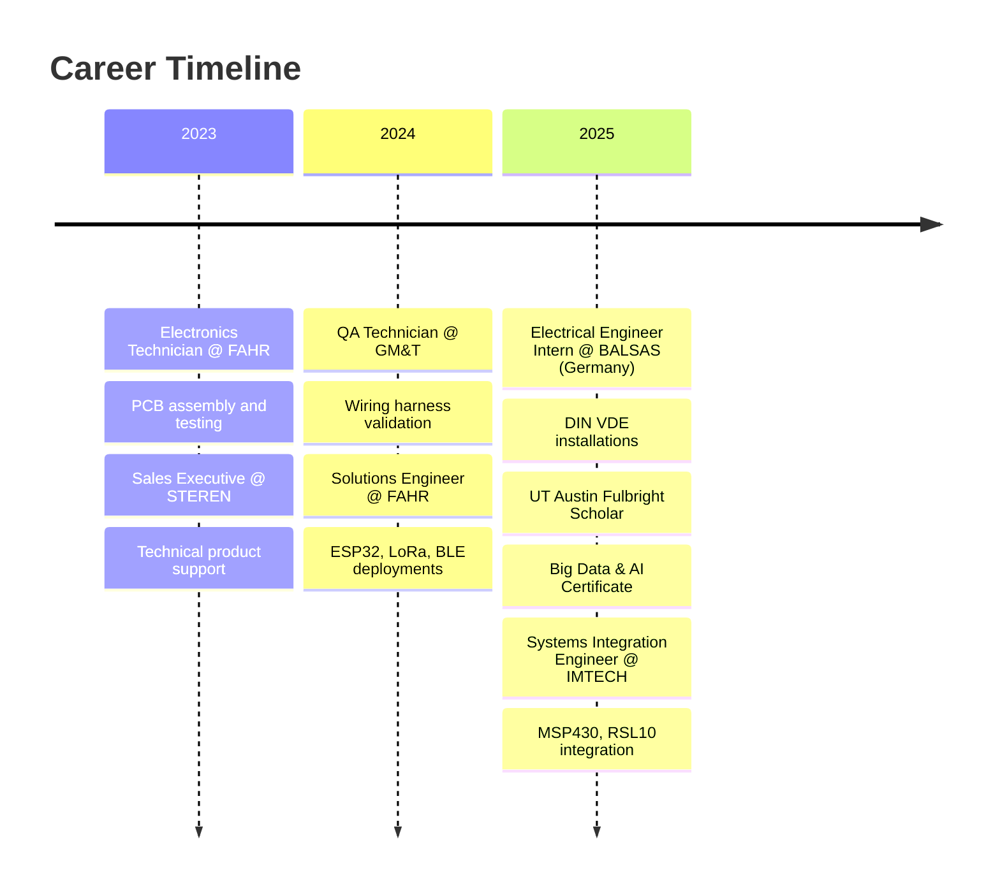

<div align="center">

<!-- Animated Header -->


<!-- Typing Animation -->
<a href="https://git.io/typing-svg"></a>

<!-- Random Dev Quote -->


<!-- Social Badges -->
<p>
<a href="https://www.linkedin.com/in/rafael-glez-chong/"></a>
<a href="mailto:rafael.glez.chong@gmail.com"></a>
<a href="https://github.com/surbalo1"></a>
<a href="https://rafael-gonzalez.vercel.app/"></a>

</p>

</div>

---

## 🧑‍💻 About Me

```yaml
name: Rafael Ignacio González Chong
location: Chihuahua, Mexico
phone: "+52 614 162 5912"
role: Systems Integration Engineer

background: |
  Electronics Engineer with hands-on experience in system integration, 
  field implementation, and technical support. I translate customer and 
  business requirements into working solutions, coordinate with cross-functional 
  teams, and drive projects from planning to deployment.

work:
  - Systems integration and field deployment
  - Embedded firmware (MSP430, RSL10, ESP32, PIC)
  - IoT connectivity (BLE, LoRa, MQTT)
  - Technical support and customer-facing solutions
  - Documentation and project coordination

languages:
  - Spanish (Native)
  - English (C1)
  - German (A2)
```

---

## ⚡ Currently

<div align="center">

| Working On | Learning | Ask Me About |
|:----------:|:--------:|:------------:|
| Systems Integration @ IMTECH | BLE protocol stack | ESP32, MSP430, RSL10 |
| Customer deployments | Cloud-edge patterns | I2C, SPI, UART |
| Validation workflows | Rust for embedded | IoT field integration |

</div>

---

## 🛠️ Tech Stack

<div align="center">

<!-- Skill Icons (Modern Display) -->
<a href="https://skillicons.dev">
  
</a>

</div>

<div align="center">

### 💻 Programming


### 🔧 Microcontrollers & Hardware


### 📡 Protocols & Connectivity


### 🤖 Data & ML


### 🛠️ Tools & Platforms


</div>

---

## 📊 GitHub Analytics

<div align="center">


</div>

<div align="center">

</div>

<div align="center">

</div>

<!-- GitHub Trophies -->
<div align="center">

### 🏆 GitHub Trophies


</div>

<!-- Profile Summary Cards -->
<div align="center">

### 📈 Profile Summary


</div>

---

## 🚀 Projects

<div align="center">

| Project | What It Does | Stack |
|:--------|:-------------|:------|
| ⚡ [**ESP32 AC Motor Controller**](https://github.com/surbalo1/esp32-ac-motor-controller) | PID speed control for AC motor using TRIAC phase-angle modulation with encoder feedback | `C++` `ESP32` `PID` |
| 🌡️ [**IoT Sensor Pipeline**](https://github.com/surbalo1/iot-sensor-pipeline) | Data ingestion from sensors → MQTT → Node.js backend → PostgreSQL → dashboard | `JavaScript` `PostgreSQL` `Docker` |
| 😊 [**Emotion Recognition**](https://github.com/surbalo1/real-time-emotion-recognition) | Webcam-based facial emotion detection using OpenCV and FER model | `Python` `OpenCV` `Streamlit` |
| 🔌 [**RSL10 I2C Communication**](https://github.com/surbalo1/RSL10-Arduino-I2C-Communication) | Software I2C bit-bang between RSL10 (master) and Arduino (slave) | `C` `I2C` `Embedded` |
| 🤖 [**AI Chatbot**](https://github.com/surbalo1/multi-personality-chatbot) | Python NLP assistant with contextual memory | `Python` `Streamlit` `LLM` |
| 📊 [**UT Austin Big Data**](https://github.com/surbalo1/ut-austin-big-data-analysis) | Predictive models from Fulbright program (80% accuracy) | `R` `Python` `TensorFlow` |
| 🔋 [**RSL10 ADC Monitor**](https://github.com/surbalo1/rsl10-adc-vddc-monitor) | 14-bit ADC voltage monitoring with UART output | `C` `ADC` `Low-Power` |
| 🔧 [**BSP for ESP32 & PIC18F**](https://github.com/surbalo1/embedded-bsp-esp32-pic18f) | Board support package with HAL for GPIO, UART, ADC | `C` `ESP32` `PIC` |

</div>

<details>
<summary>📂 <b>All Projects by Category</b></summary>

### 🔌 Embedded Systems & Firmware
- [`esp32-ac-motor-controller`](https://github.com/surbalo1/esp32-ac-motor-controller) - PID-based AC motor control with phase-angle modulation
- [`embedded-bsp-esp32-pic18f`](https://github.com/surbalo1/embedded-bsp-esp32-pic18f) - Hardware abstraction layer for ESP32 and PIC18F
- [`rsl10-blinky-rtt-debug`](https://github.com/surbalo1/rsl10-blinky-rtt-debug) - ARM Cortex-M3 LED control with SEGGER RTT debugging
- [`RSL10-UART-LED-Control`](https://github.com/surbalo1/RSL10-UART-LED-Control) - Bidirectional UART with command confirmation
- [`RSL10-SysTick-Timestamp`](https://github.com/surbalo1/RSL10-SysTick-Timestamp) - SysTick timestamp system with low-power sleep
- [`rsl10-adc-vddc-monitor`](https://github.com/surbalo1/rsl10-adc-vddc-monitor) - 14-bit ADC voltage monitoring
- [`msp430-arduino-uart-bridge`](https://github.com/surbalo1/msp430-arduino-uart-bridge) - Serial bridge with state machine

### 🌐 IoT & Connectivity
- [`iot-sensor-pipeline`](https://github.com/surbalo1/iot-sensor-pipeline) - MQTT → Node.js → PostgreSQL → Dashboard
- [`sensor-dashboard`](https://github.com/surbalo1/sensor-dashboard) - Real-time visualization with Socket.io and Chart.js
- [`esp32-weather-client`](https://github.com/surbalo1/esp32-weather-client) - Weather dashboard with MQTT
- [`RSL10-Arduino-I2C-Communication`](https://github.com/surbalo1/RSL10-Arduino-I2C-Communication) - Software I2C implementation

### 🤖 AI & Data
- [`Pharmacy-AI-automation-system`](https://github.com/surbalo1/Pharmacy-AI-automation-system) - AI assistant for pharmacy operations
- [`ai-coaching-system`](https://github.com/surbalo1/ai-coaching-system) - FastAPI + React coaching platform
- [`multi-personality-chatbot`](https://github.com/surbalo1/multi-personality-chatbot) - LLM chatbot with memory
- [`real-time-emotion-recognition`](https://github.com/surbalo1/real-time-emotion-recognition) - Facial emotion detection
- [`ut-austin-big-data-analysis`](https://github.com/surbalo1/ut-austin-big-data-analysis) - Predictive analytics projects

</details>

---

## 💼 Experience

<div align="center">



</div>

### 🏢 Current Role
**Systems Integration Engineer** @ IMTECH Desarrollos *(Sep 2025 - Dec 2025)*
- Integrated MSP430 and RSL10 platforms into 5+ customer systems using C
- Developed workflows and KPIs that improved alignment between technical and commercial teams by 20%
- Supported onboarding of junior engineers and delivery execution
- Tools: UART, SPI, I2C, PLC test benches, PCBs, schematics, Git

### 🌍 International Experience
**Electrical Engineer Intern** @ BALSAS GmbH, Germany *(Jan 2025 - Jul 2025)*
- Supported residential electrical renovations under DIN VDE standards
- Coordinated with customers, inspectors, and contractors on site
- Helped resolve installation issues to meet inspection and delivery requirements

### 💡 Previous Roles

<details>
<summary><b>Solutions Engineer @ FAHR Electronic Systems</b> (May 2024 - Jan 2025)</summary>

- Implemented ESP32 solutions using MicroPython with LoRa, BLE, and OTA
- Delivered technical demos and validated prototypes for customers
- Produced deployment and maintenance documentation
- Tools: ESP32, MicroPython, LoRa, BLE, OTA, UART, SPI, I2C, Git
</details>

<details>
<summary><b>QA Technician @ GM&T Engineering, Inc.</b> (Nov 2023 - May 2024)</summary>

- Executed wiring harness validation per OEM and ISO TS 16949 standards
- Supported root cause analysis and continuous improvement
- Achieved 98% first-pass yield
- Tools: Wiring harness testers, multimeter
</details>

<details>
<summary><b>Sales Executive @ STEREN Mexico</b> (Jun 2023 - Nov 2023)</summary>

- Advised customers on electronic products, increasing repeat purchases by 10%
- Supported pre-sales product selection and basic troubleshooting
- Tools: POS systems, product catalogs, technical datasheets
</details>

<details>
<summary><b>Electronics Technician @ FAHR Electronic Systems</b> (Jan 2023 - Jun 2023)</summary>

- Assembled and tested IoT PCB prototypes
- Supported installation troubleshooting, reducing debugging time by 25%
- Assisted with prototype validation for customer acceptance
- Tools: Oscilloscope, soldering tools, IoT sensors
</details>

---

## 🎓 Education

<div align="center">

| Institution | Degree | Period | Notes |
|:------------|:-------|:-------|:------|
| 🏛️ **University of Texas at Austin** | Global Summer Institute (Big Data & AI) | Jul-Aug 2025 | Fulbright-COMEXUS Scholar • 120hr program • Built predictive models (80% accuracy) with Python, TensorFlow, PyTorch |
| 🎓 **Chihuahua Institute of Technology** | B.Sc. Electronic Engineering | Aug 2020 - Dec 2024 | GPA: 90.83/100 • Minor: Intelligent Embedded Systems • Courses: RTOS, FPGA, DSP, Microcontrollers, PLC, Power Electronics • IEEE Student Branch • Coordinated Top Business Leader Diploma (50+ students) |

</div>

---

## 🏆 Certifications

<div align="center">

### 🔐 Cybersecurity
-FF0000?style=flat-square&logo=comptia&logoColor=white)

### ☁️ Cloud & AI
-0078D4?style=flat-square&logo=microsoftazure&logoColor=white)


### 📊 Data & Analytics


### 📋 Project Management


### 💻 Development


### 🌐 Languages
-58CC02?style=flat-square&logo=duolingo&logoColor=white)

</div>

---

## 📫 Contact

<div align="center">

Open to discussing embedded systems, IoT, or collaboration opportunities.

[](https://www.linkedin.com/in/rafael-glez-chong/)
[](mailto:rafael.glez.chong@gmail.com)

</div>

---

<div align="center">

<!-- Snake Animation (Generated from my contributions) -->
<picture>
  <source media="(prefers-color-scheme: dark)" srcset="https://raw.githubusercontent.com/surbalo1/surbalo1/output/github-snake-dark.svg">
  <source media="(prefers-color-scheme: light)" srcset="https://raw.githubusercontent.com/surbalo1/surbalo1/output/github-snake.svg">
  
</picture>


<!-- 3D Contribution Calendar (Generated by GitHub Action) -->


</div>

---

<div align="center">

<!-- Random Joke -->


</div>

---

<div align="center">

### *Electronics Engineer — Embedded Systems, IoT, Field Implementation*


</div>
