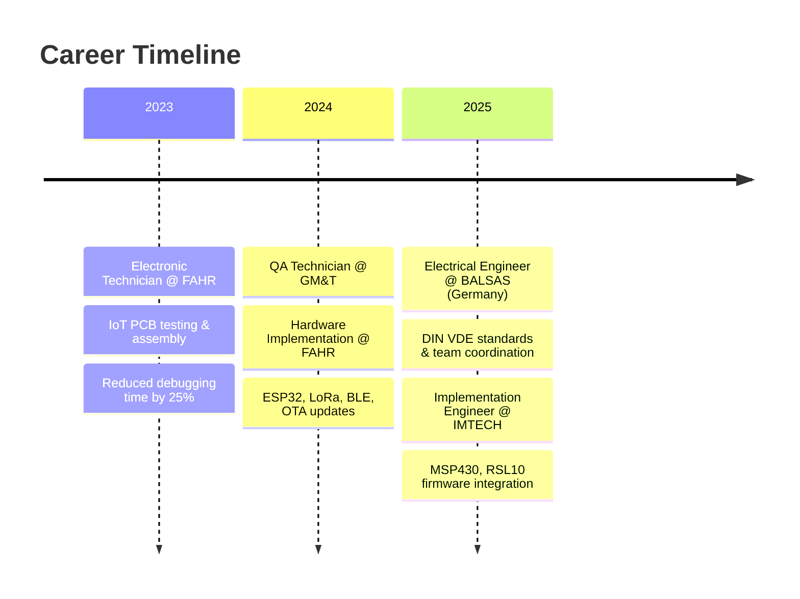

<div align="center">

<!-- Animated Header -->


<!-- Typing Animation -->
<a href="https://git.io/typing-svg"></a>

<!-- Social Badges -->
<p>
<a href="https://www.linkedin.com/in/rafael-glez-chong/"></a>
<a href="mailto:rafael.glez.chong@gmail.com"></a>
<a href="https://github.com/surbalo1"></a>

</p>

</div>

---

## 🧑‍💻 About Me

```yaml
name: Rafael Ignacio González Chong
location: Chihuahua, Mexico 🇲🇽
current_role: Implementation & System Integration Engineer @ IMTECH
education: B.Sc. Electronic Engineering | UT Austin Fulbright Scholar (Big Data & AI)

focus_areas:
  - Low-Power Firmware Development (MSP430, RSL10, ESP32)
  - IoT & Connectivity Protocols (BLE, LoRa, MQTT, Cellular)
  - AI/ML Integration for Embedded Systems
  - Real-time Systems & RTOS

passions:
  - Making hardware and software work in perfect harmony
  - Optimizing systems for performance and power efficiency
  - Building end-to-end IoT solutions from sensor to cloud
  - Open-source embedded projects

languages: ["Spanish 🇪🇸 (Native)", "English 🇬🇧 (C1)", "German 🇩🇪 (A2)"]
```

---

## 🛠️ Tech Stack

<div align="center">

### 💻 Programming Languages


### 🔧 Microcontrollers & Hardware


### 📡 Protocols & Connectivity


### 🤖 AI & Machine Learning


### 🛠️ Tools & Platforms


</div>

---

## 📊 GitHub Analytics

<div align="center">


</div>

<div align="center">

</div>

<div align="center">

</div>

---

## 🚀 Featured Projects

<div align="center">

| Project | Description | Tech Stack |
|:--------|:------------|:-----------|
| 🔧 [**Pharmacy AI Automation**](https://github.com/surbalo1/Pharmacy-AI-automation-system) | HIPAA-compliant AI platform for pharmacies with multi-channel communication | `Python` `FastAPI` `OpenAI` |
| ⚡ [**ESP32 AC Motor Controller**](https://github.com/surbalo1/esp32-ac-motor-controller) | Real-time AC motor speed control using TRIAC phase-angle modulation | `C++` `ESP32` `Power Electronics` |
| 🌡️ [**IoT Sensor Pipeline**](https://github.com/surbalo1/iot-sensor-pipeline) | End-to-end IoT solution: MQTT → Node.js → PostgreSQL → Real-time Dashboard | `JavaScript` `PostgreSQL` `Docker` |
| 😊 [**Emotion Recognition**](https://github.com/surbalo1/real-time-emotion-recognition) | Real-time facial emotion detection using Streamlit, OpenCV & FER | `Python` `OpenCV` `ML` |
| 🔌 [**RSL10 I2C Communication**](https://github.com/surbalo1/RSL10-Arduino-I2C-Communication) | Bidirectional I2C between RSL10 (master) and Arduino (slave) | `C` `I2C` `Embedded` |
| 🤖 [**Multi-Personality Chatbot**](https://github.com/surbalo1/multi-personality-chatbot) | AI chatbot with contextual memory and multiple personalities | `Python` `Streamlit` `LLM` |
| 📊 [**UT Austin Big Data**](https://github.com/surbalo1/ut-austin-big-data-analysis) | Predictive analytics and statistical modeling from Fulbright program | `R` `SQL` `Data Science` |
| 🔋 [**RSL10 ADC VDDC Monitor**](https://github.com/surbalo1/rsl10-adc-vddc-monitor) | Internal voltage monitoring with dynamic switching and UART output | `C` `ADC` `Low-Power` |

</div>

<details>
<summary>📂 <b>View All Projects by Category</b></summary>

### 🔌 Embedded Systems & Firmware
- [`esp32-ac-motor-controller`](https://github.com/surbalo1/esp32-ac-motor-controller) - PID-based AC motor control with phase-angle modulation
- [`embedded-bsp-esp32-pic18f`](https://github.com/surbalo1/embedded-bsp-esp32-pic18f) - Hardware Abstraction Layer (HAL) for ESP32 & PIC18F
- [`rsl10-blinky-rtt-debug`](https://github.com/surbalo1/rsl10-blinky-rtt-debug) - ARM Cortex-M3 LED control with SEGGER RTT debugging
- [`RSL10-UART-LED-Control`](https://github.com/surbalo1/RSL10-UART-LED-Control) - Bidirectional UART communication with command confirmation
- [`RSL10-SysTick-Timestamp`](https://github.com/surbalo1/RSL10-SysTick-Timestamp) - SysTick-based timestamp system with low-power sleep
- [`rsl10-adc-vddc-monitor`](https://github.com/surbalo1/rsl10-adc-vddc-monitor) - 14-bit ADC voltage monitoring with dynamic switching
- [`msp430-arduino-uart-bridge`](https://github.com/surbalo1/msp430-arduino-uart-bridge) - Serial communication bridge with state machine

### 🌐 IoT & Connectivity
- [`iot-sensor-pipeline`](https://github.com/surbalo1/iot-sensor-pipeline) - Full-stack IoT: MQTT → Node.js → PostgreSQL → Dashboard
- [`sensor-dashboard`](https://github.com/surbalo1/sensor-dashboard) - Real-time sensor visualization with Socket.io & Chart.js
- [`esp32-weather-client`](https://github.com/surbalo1/esp32-weather-client) - Weather dashboard with MQTT streaming
- [`RSL10-Arduino-I2C-Communication`](https://github.com/surbalo1/RSL10-Arduino-I2C-Communication) - Software I2C bit-bang implementation

### 🤖 AI & Machine Learning
- [`Pharmacy-AI-automation-system`](https://github.com/surbalo1/Pharmacy-AI-automation-system) - HIPAA-compliant AI for pharmacy automation
- [`ai-coaching-system`](https://github.com/surbalo1/ai-coaching-system) - Autonomous AI coaching ecosystem with FastAPI & React
- [`multi-personality-chatbot`](https://github.com/surbalo1/multi-personality-chatbot) - LLM-powered chatbot with dynamic personalities
- [`real-time-emotion-recognition`](https://github.com/surbalo1/real-time-emotion-recognition) - Facial emotion detection with FER model

### 📊 Data Science
- [`ut-austin-big-data-analysis`](https://github.com/surbalo1/ut-austin-big-data-analysis) - Big data projects from UT Austin Fulbright program

</details>

---

## 💼 Professional Journey

<div align="center">



</div>

### 🏢 Current Role
**Implementation & System Integration Engineer** @ IMTECH Desarrollos *(Sep 2025 - Present)*
- 🔧 Leading embedded platform integration (MSP430, RSL10) in C
- 📋 Defining firmware-hardware validation workflows with PLC test benches
- 👥 Mentoring junior engineers & advising on operational improvements
- 🎯 Aligning technical solutions with business goals

### 🌍 International Experience
**Electrical Engineer Intern** @ BALSAS GmbH, Germany *(Jan - Jun 2025)*
- 🇩🇪 Residential electrical renovations per DIN VDE standards
- 📅 Team coordination, scheduling, and materials management
- ✅ Inspection compliance and installation quality assurance

---

## 🎓 Education

<div align="center">

| Institution | Degree | Year | Highlights |
|:------------|:-------|:-----|:-----------|
| 🏛️ **University of Texas at Austin** | Certificate - Big Data & AI | 2025 | Fulbright-COMEXUS Scholar • 120hr intensive • 80% accuracy ML models |
| 🎓 **Chihuahua Institute of Technology** | B.Sc. Electronic Engineering | 2020-2024 | GPA: 90.83/100 • Minor: Intelligent Embedded Systems |

</div>

---

## 🏆 Certifications & Achievements

<div align="center">


-FF0000?style=flat-square&logo=comptia&logoColor=white)


</div>

---

## 📫 Let's Connect!

<div align="center">

I'm always open to discussing embedded systems, IoT solutions, AI integration, or collaboration opportunities!

[](https://www.linkedin.com/in/rafael-glez-chong/)
[](mailto:rafael.glez.chong@gmail.com)

</div>

---

<div align="center">

<!-- Snake Animation (Generated from my contributions) -->
<picture>
  <source media="(prefers-color-scheme: dark)" srcset="https://raw.githubusercontent.com/surbalo1/surbalo1/output/github-snake-dark.svg">
  <source media="(prefers-color-scheme: light)" srcset="https://raw.githubusercontent.com/surbalo1/surbalo1/output/github-snake.svg">
  
</picture>


</div>

---

<div align="center">

### 💡 *"Turning embedded systems into smart solutions — from firmware to cloud, from sensors to AI."*


</div>
